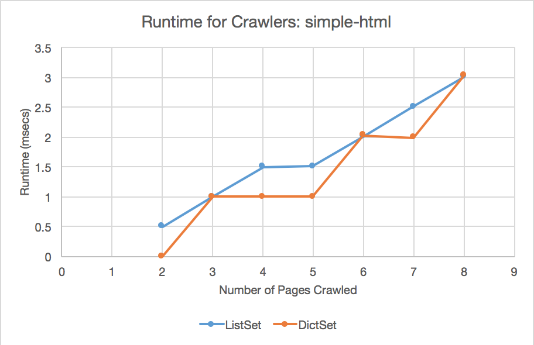
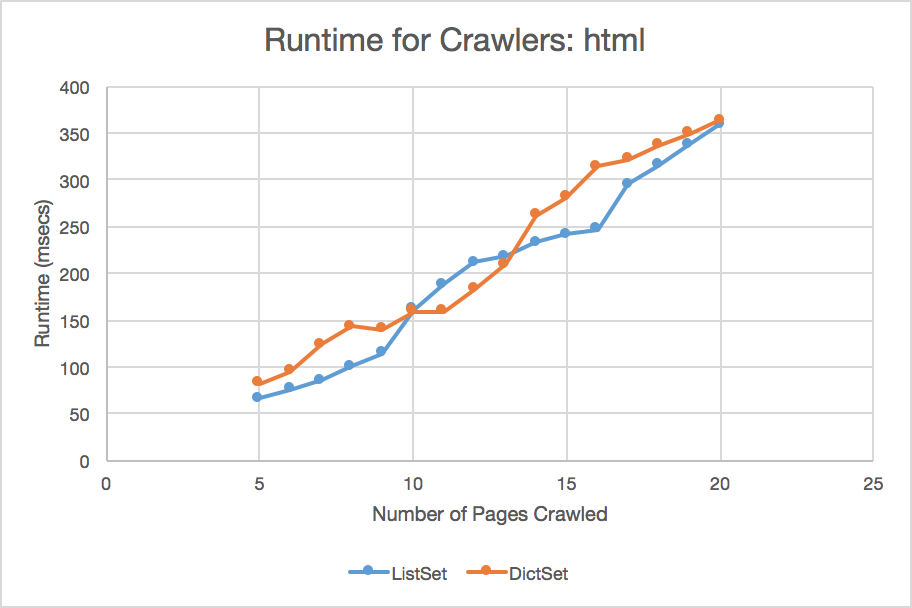
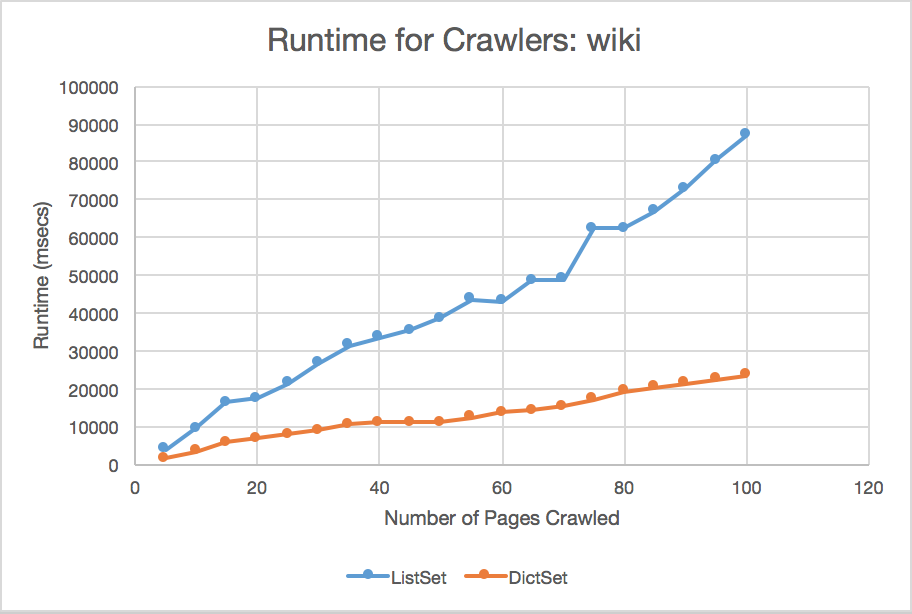
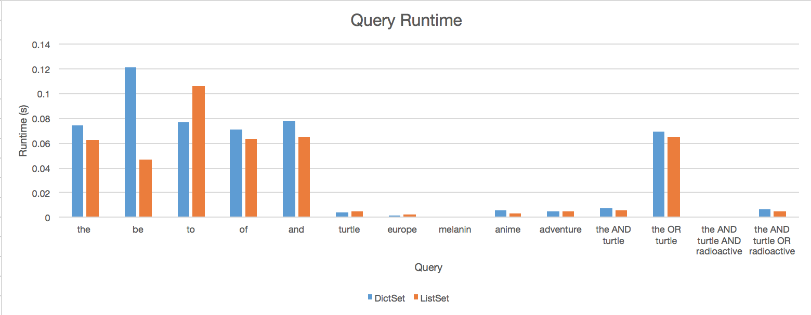

### CS51 PSET 5 WRITEUP
##### Matthew Li and Alice Liu

#### Part 1: Crawl

First, we use our crawl function to crawl through simple-html, html, and wiki.    
We compare the runtime speeds of using the ListSet module versus DictSet.   
The results are shown below: 

* _**Note:** Raw data were obtained from the test file tests.ml, and can be found   
	in the file_ cs51pset5.xlsx _under the tabs simple-html, html, and wiki._

From these data, we see that, for smaller sample sizes (fewer webpages to crawl),   
there is no significant difference in the efficiency of the two modules; occasionally,   
the ListSet crawler yields faster runtimes than the DictSet one. However, for larger   
numbers of pages, DictSet is considerably faster for crawling and indexing pages than   
ListSet. 

This is likely because the DictSet module we use results in sets of binary trees,   
while the ListSet module simply uses lists as sets. Binary search trees   
have O(log(n)) search time, while lists have O(n) search time. Since our crawler   
needs to search through the **frontier** and **visited** sets in order to avoid   
infinite looping and to reduce the size of the frontier, the runtime of the crawler   
depends upon the efficiency of searching the set. 

Since binary search trees are considerably more efficient than lists for large    
amounts of data, the crawler using DictSet will become much faster than that    
using ListSet as the amount of data increases.

#### Part 2: Queries

Next, we compare the runtimes of different queries using a ListSet and DictSet-based   
implementation. Our search words include common words like "the" and "be" and   
more specific terms such as "turtle" and "melanin". We also have queries using AND   
and OR. We expect that common words will take more time to search and display than   
rarer ones, because although the average runtime should be equal regardless of the   
query, it takes some time to display the search results on the webpage. In   
addition, due to variation in computation time, we have averaged runtime results for   
5 different trials for each query. The results are displayed below:

* _**Note:** Raw data were obtained from manual testing, and can be found   
	in the file_ cs51pset5.xlsx _under the tab_ queries.

We see that, as expected, more common words have taken more time to search and store   
(insert) than less common ones. Also, a query between some two words that uses AND   
requires less runtime than one using OR. This is expected, as OR yields >= search   
results than AND, and these search results would require more time to store.

Although DictSet was faster than ListSet in crawling and indexing, it is, on average,   
slower than ListSet when it comes to querying, despite utilizing binary search trees.   
This may be due to the fact that, although binary search trees are faster to search   
through than lists, they take longer to display a list of results (the links that we   
see). This is because DictSet uses binary search trees, which are not automatically   
displayable as lists. So we have to iterate through each node to convert the tree to   
a list. Meanwhile, it takes longer to search through a list in ListSet, but since   
ListSet already uses lists, once we find the value, we can easily display it with   
almost no time expended. Therefore, most of ListSet's query runtime comes from the   
searching itself, while most of DictSet's query runtime comes from the conversion of   
the tree to an easily displayable list format. The more frequent the query, the longer   
DictSet's runtime in comparison with ListSet's. 
